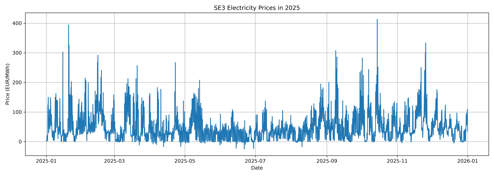
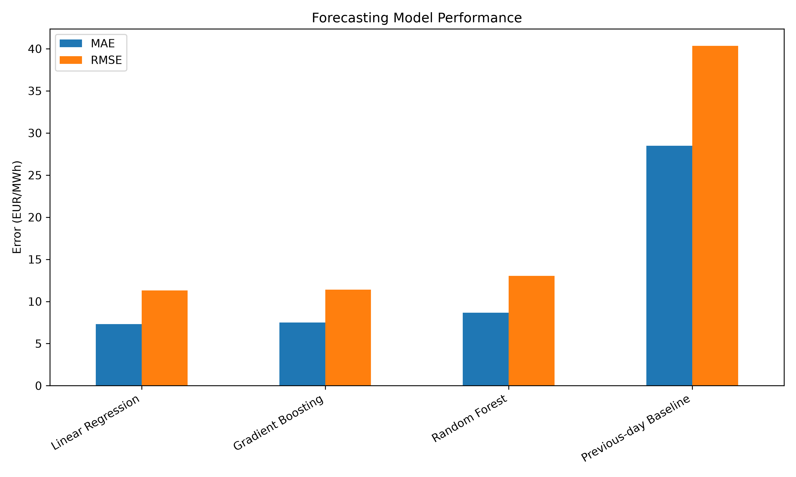

# swedish-electricity-price-forecasting

Forecasting Swedish electricity prices using time-series analysis and machine learning.

## Project Overview

This project investigates short-term electricity price forecasting for the Swedish SE3 bidding zone using time-series analysis and machine learning.

The objective is to compare a simple baseline forecast with machine-learning models and evaluate their predictive performance.

## Dataset

The project uses SE3 electricity-price data for 2025.

The source data contained both hourly and 15-minute observations. The 15-minute observations were aggregated into hourly averages to create a consistent hourly time series.

The final dataset contains:

- 8,760 hourly observations
- No missing electricity-price values
- Electricity prices measured in EUR/MWh

## Features

The following features were used:

- Hour of day
- Day of week
- Month
- Price 1 hour earlier
- Price 24 hours earlier
- Price 168 hours earlier

## Models

The following forecasting approaches were compared:

- Previous-day baseline
- Linear Regression
- Random Forest
- Gradient Boosting

## Model Results

| Model | MAE (EUR/MWh) | RMSE (EUR/MWh) |
|---|---:|---:|
| Linear Regression | 7.32 | 11.32 |
| Gradient Boosting | 7.51 | 11.39 |
| Random Forest | 8.65 | 13.04 |
| Previous-day Baseline | 28.47 | 40.34 |

Linear Regression achieved the lowest MAE and RMSE on the chronological test set.

For the current feature set, the simpler linear model performed better than the more complex tree-based models.

## Methodology

The dataset was split chronologically into training and test sets to preserve the time-series structure and avoid random shuffling.

Model performance was evaluated using:

- Mean Absolute Error (MAE)
- Root Mean Squared Error (RMSE)

## Technologies

- Python
- pandas
- NumPy
- Matplotlib
- scikit-learn
- Jupyter Notebook
- Git
- GitHub

## Future Improvements

Future work could include:

- Weather data integration
- Electricity-demand data
- Additional lag and rolling-window features
- XGBoost or LightGBM
- Walk-forward cross-validation
- Hyperparameter tuning
- Feature-importance analysis
## Visualizations

### SE3 Electricity Price Trend

### Model Performance Comparison

